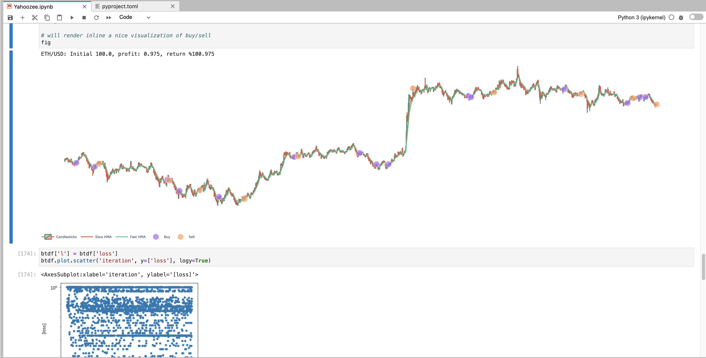

# Mischa's Crypto Trader
Automating crypto trading with python.

## What is this?
A jupyter notebook to demonstrate automating crypto trading. Includes defining a strategy with automated parameter tuning and backtesting.

Please [read my article describing how it works](https://spiegelmock.com/2021/11/09/how-to-trade-crypto-in-your-sleep-with-python/) for more details and how to use it yourself.

## How does it work?
Allows you to [pick a strategy](https://github.com/twopirllc/pandas-ta/blob/main/examples/PandasTA_Strategy_Examples.ipynb) and optimize the parameters to the trading bot and strategy automatically. Different parameters are tried and net profit calculated during backtesting.

* Uses [pyjuque](https://github.com/tudorelu/pyjuque) to perform backtesting and trading and bot framework.
* Technical analysis performed by [ta-lib](https://www.ta-lib.org/) and [pandas-ta](https://github.com/twopirllc/pandas-ta/) - generate buy and sell signals from time series exchange data.
* Crypto exchange abstraction provided by [CCXT](https://ccxt.readthedocs.io/en/latest/) - connects to any crypto exchange.
* Parameter tuning with [scikit-optimize](https://scikit-optimize.github.io/) - Minimizes objective function in trading bot and strategy parameter space.

## How do I test strategies? 
Load up [the notebook](strategize-skopt.ipynb) in [JupyterLab](https://jupyterlab.readthedocs.io/en/stable/).

## Screenshots




## How do I run the bot?
Create a .env file with your exchange API key
```env
EXCHG_API_KEY=daJF91jf9soq01j9wwl
EXCHG_SECRET=8ABC9130181DEB9131
#EXCHG_SUBACCOUNT=trader
```

Run ./run-bot.py

For more details about building and running the bot see the Dockerfile.
